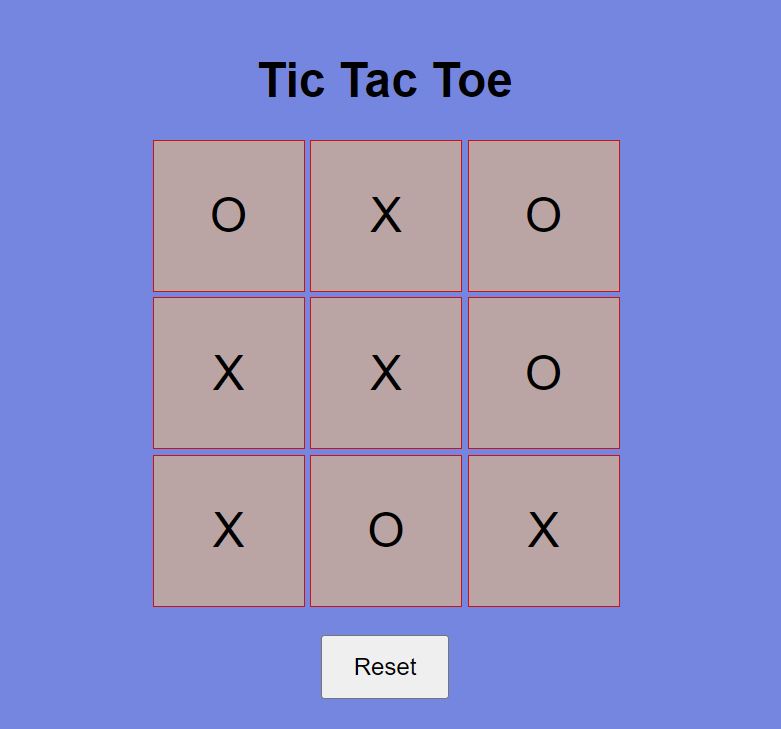

"# yatzy-game" 
# Tic Tac Toe Game

Tic Tac Toe is a classic two-player game where the objective is to be the first to form a line of three symbols (X or O) horizontally, vertically, or diagonally. In our Tic Tac Toe game, the user will be playing against the "AI" (Computer) which will randomly pick an empty box to add either the X or O

## How to Play
1. Player 1 is X and Computer is O. Players take turns placing their symbols on the 3x3 grid.
2. The first player to get three of their symbols (X or O) in a row (horizontally, vertically, or diagonally) wins the game.
3. If all nine squares are filled and neither player has three in a row, the game is a draw.

## User Interface States

